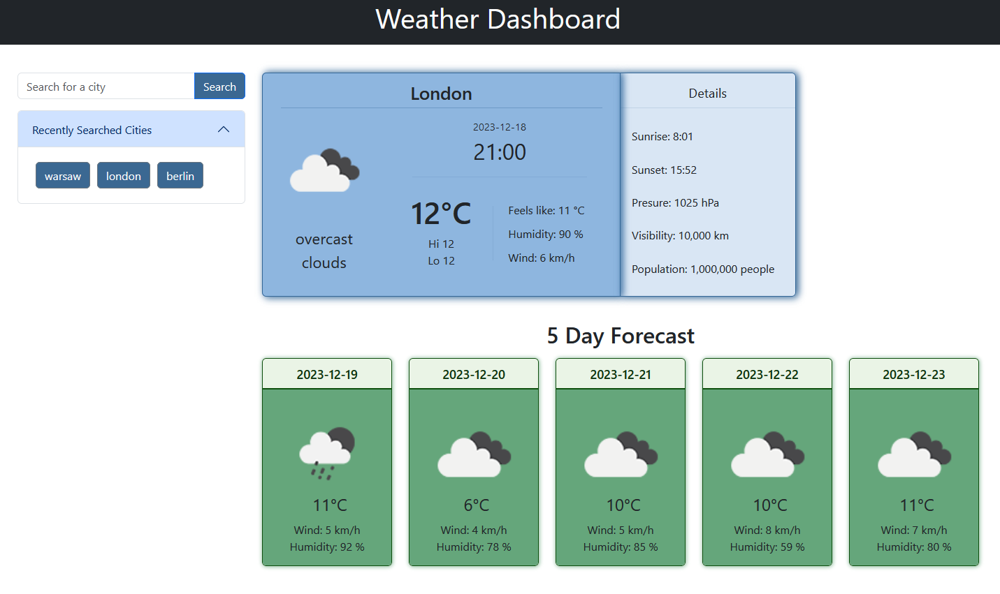

# Weather Dashboard

## Overview

The Weather Dashboard is a browser-based application that provides users with dynamically updated weather information for cities. It utilizes the 5 Day Weather Forecast API to retrieve weather data. Users can search for a city, view current weather details, and access a 5-day forecast.

The primary tools used include:

- **jQuery:** Used for DOM manipulation, dynamic HTML element creation, and animation.

- **OpenWeatherMap API:** Integrated for fetching a 5-day weather forecast for cities.

- **Bootstrap:** Employed to enhance the UI, ensuring a polished and mobile-friendly design.

## Screenshot

*A snapshot of the Weather Dashboard interface with a clean, user-friendly design.*

## Features

- **City Search:** Users can enter the name of a city in the search input to retrieve weather information.

- **5 Day Forecast:** The application displays a 5-day weather forecast for the selected city.

- **Persistent Storage:** User searches are stored in the local storage, creating a search history that users can reference.

- **Current Weather Details:** In addition to basic information like temperature, date, humidity, and wind, the current weather card includes additional details such as sunrise and sunset times, pressure, visibility, and population.

## How to Use It

1. Clone the repository.
2. Open the `index.html` file in your preferred web browser.
3. Interaction with the Weather Dashbord:
  - **Load or Refresh:** On the first load or refresh, the page presents a search input only.
  
  - **Search for a City:** Search for a City Type the name of a city in the search input.
      
  - **View Weather Details:** Press "Search" or hit "Enter" to shift the search input to the left and display weather details for the entered city.

  - **Access Search History:** Previously searched cities are added to the search history. Click on a city in the search history to view its weather details.

4. Alternatively, you can use the Weather Dashbord directly simply navigate to the [GitHub Pages](https://martindocs.github.io/weather-dashboard/).

## Future Enhancements

- **Unit Selection:** Allow users to toggle between metric and imperial units for temperature and other weather metrics.

- **Interactive Map:** Implement an interactive map feature to visually display the location of the selected city.

- **User Preferences:** Enable users to customize the application settings according to their preferences.

## Credits

N/A (Open for contributions).

## License

Please refer to the [LICENSE](./LICENSE.md) file in this repository for details on how this project is licensed.
